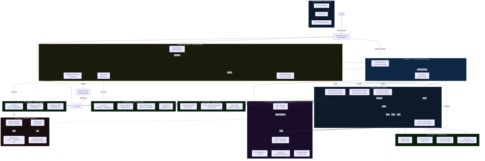

```mermaid
graph TB
    U([👤 User]) -->|company name| UI[Streamlit Dashboard<br/>frontend/app.py]
    UI -->|validate + dispatch| O

    subgraph ADK ["🔷 Google ADK — Orchestrator Planning Loop"]
        O[Orchestrator Agent<br/>orchestrator_agent.py]
        O -->|decompose tasks| PLAN[Task Planner<br/>parallel dispatch]
    end

    subgraph GUARDRAILS ["🛡️ Safety Guardrails — guardrails/safety.py"]
        GI[Input Validation<br/>injection detection]
        GO[Output Schema Check<br/>PII scrubbing]
        GR[Rate Limiter<br/>per MCP tool]
        GB[Forbidden Tool Block<br/>no destructive actions]
    end

    UI --> GI
    GI -->|clean input| O

    subgraph AGENTS ["🤖 Specialist Agents — agents/"]
        A2[Market Research Agent<br/>market_research_agent.py]
        A3[Financial Analyst Agent<br/>financial_analyst_agent.py]
        A4[Risk Assessor Agent<br/>risk_assessor_agent.py]
        A5[Sentiment & News Agent<br/>sentiment_news_agent.py]
    end

    PLAN -->|parallel| A2
    PLAN -->|parallel| A3
    PLAN -->|parallel| A4
    PLAN -->|parallel| A5

    subgraph MCP2 ["MCP Toolbox — Market Research"]
        T21[web_search<br/>Tavily → DuckDuckGo]
        T22[wikipedia_summary<br/>Wikipedia API]
        T23[crunchbase_lookup<br/>web search proxy]
    end

    subgraph MCP3 ["MCP Toolbox — Financial Analyst"]
        T31[resolve_ticker<br/>yfinance lookup]
        T32[get_financial_data<br/>yfinance live]
        T33[get_historical_prices<br/>1-year chart data]
        T34[web_search<br/>private company fallback]
    end

    subgraph MCP4 ["MCP Toolbox — Risk Assessor"]
        T41[search_legal_issues<br/>lawsuit / fines]
        T42[search_founder_background<br/>exec history]
        T43[web_search<br/>regulatory exposure]
    end

    subgraph MCP5 ["MCP Toolbox — Sentiment & News"]
        T51[get_news<br/>NewsAPI → Google RSS]
        T52[analyze_sentiment<br/>rule-based NLP]
        T53[get_reddit_mentions<br/>PRAW → web fallback]
        T54[web_search<br/>reputation scan]
    end

    A2 --> T21 & T22 & T23
    A3 --> T31 & T32 & T33 & T34
    A4 --> T41 & T42 & T43
    A5 --> T51 & T52 & T53 & T54

    GR -->|rate check| T21
    GR -->|rate check| T32
    GR -->|rate check| T51

    subgraph A2A ["🔀 A2A Protocol — a2a/messaging.py + a2a/server.py"]
        BUS[A2A Message Bus<br/>in-process]
        MSG_FLAG[FLAG message<br/>Risk → Financial]
        MSG_RESULT[RESULT message<br/>agent → orchestrator]
        CARD[Agent Card<br/>/.well-known/agent.json]
        SSE[SSE Event Stream<br/>/tasks/id/events]
    end

    A4 -->|critical flag| MSG_FLAG
    MSG_FLAG -->|re-analysis trigger| A3
    A2 & A3 & A4 & A5 -->|results| MSG_RESULT
    MSG_RESULT --> BUS

    subgraph RETRY ["⟳ Recovery — agents/base_agent.py"]
        R1[Exponential Backoff<br/>tenacity, 3 attempts]
        R2[Fallback Chain<br/>primary → secondary → mock]
        R3[Timeout Guard<br/>45s per agent]
        R4[Dead-Agent Skip<br/>partial report on failure]
    end

    T21 -.->|fail| R1
    R1 -.->|all fail| R2
    A2 -.->|timeout| R3
    R3 -.->|killed| R4

    BUS --> O
    O -->|raw data| GO
    GO -->|sanitised| GEM[Gemini 1.5 Flash<br/>Report Synthesis]
    GEM -->|JSON report| FINAL[Final Report]
    FINAL --> UI

    subgraph API ["🌐 A2A REST API — a2a/server.py"]
        EP1[POST /tasks/send]
        EP2[GET /tasks/id]
        EP3[GET /tasks/id/events SSE]
        CARD
    end

    style ADK fill:#0d2744,stroke:#4fc3f7,color:#e0e6f0
    style GUARDRAILS fill:#1a1a0d,stroke:#f59e0b,color:#e0e6f0
    style AGENTS fill:#0d1a2a,stroke:#60a5fa,color:#e0e6f0
    style A2A fill:#1a0d2a,stroke:#a78bfa,color:#e0e6f0
    style RETRY fill:#1a0d0d,stroke:#f87171,color:#e0e6f0
    style MCP2 fill:#0a1f0a,stroke:#34d399,color:#e0e6f0
    style MCP3 fill:#0a1f0a,stroke:#34d399,color:#e0e6f0
    style MCP4 fill:#0a1f0a,stroke:#34d399,color:#e0e6f0
    style MCP5 fill:#0a1f0a,stroke:#34d399,color:#e0e6f0
    style API fill:#0d1a2a,stroke:#60a5fa,color:#e0e6f0
```
